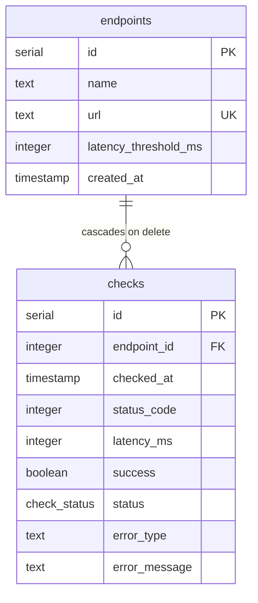

# PulseCheck Deployment-Compatible Scheduling Design

## 1. Document Status

- **Phase**: 7E-A
- **Status**: Design Only
- **Scope**: Architecture and operational design for deploying PulseCheck's scheduled monitoring pipeline with external cron triggers.
- **Author/Role**: Senior Backend & SRE Engineer
- **Related Documents**:
  - [`docs/SCHEDULING_DESIGN.md`](file:///d:/Pulse_Health/docs/SCHEDULING_DESIGN.md) — Scheduling Architecture & System Principles
  - [`docs/SCHEDULING_SPEC.md`](file:///d:/Pulse_Health/docs/SCHEDULING_SPEC.md) — Implementation Specification
  - [`docs/RELIABILITY_TESTING_DESIGN.md`](file:///d:/Pulse_Health/docs/RELIABILITY_TESTING_DESIGN.md) — Reliability Verification Strategy
  - [`docs/RELIABILITY_TESTING_SPEC.md`](file:///d:/Pulse_Health/docs/RELIABILITY_TESTING_SPEC.md) — Authoritative Reliability Test Suite (REL-001 through REL-023)

---

## 2. Problem Statement

PulseCheck was originally implemented with manual, on-demand health checks initiated via the dashboard ("Check Now" button). While functional for ad-hoc diagnosis, manual invocation is fundamentally insufficient for an operational availability and latency monitoring system. Service degradations, intermittent network partitions, and cascading outages occur unpredictably; detecting them requires continuous, periodic probing.

To transition PulseCheck into an automated monitoring system in a production deployment, the application must execute scheduled checks reliably across all registered endpoints. However, implementing scheduling directly inside the Next.js application process—using `setInterval()`, `node-cron`, or a continuous background worker thread—introduces severe production anti-patterns:

1. **Serverless & Ephemeral Lifecycle Incompatibility**: Modern deployments (Vercel, AWS Lambda, Cloud Run, ephemeral container instances) spin down execution contexts when idle. An in-process timer ceases to execute as soon as the runtime freezes or terminates the process between incoming HTTP requests.
2. **Horizontal Process Duplication**: If multiple instances of the Next.js server are deployed behind a load balancer, each instance would run its own independent in-process timer. Without distributed synchronization, this leads to duplicate, uncontrolled health checks against target APIs and multiplied database write pressure.
3. **Memory Leaks and Process Instability**: Long-lived timers in web application runtimes accumulate unreclaimed closure references, database connection pool leaks, and unhandled event loop lag over days of uptime.
4. **Lack of Deployment Durability**: When an instance restarts for a new deployment or autoscaling event, all in-memory scheduling state is lost, causing check schedule drift or silent monitoring blackouts.

**Design Decision**: PulseCheck explicitly excludes `setInterval()` and long-running in-process scheduler loops. Instead, scheduling responsibility is externalized: an external cron trigger invokes an authenticated, stateless HTTP endpoint (`POST /api/cron/check`), allowing PulseCheck to maintain a purely request-driven, deployment-agnostic architecture.

---

## 3. Goals

1. **Periodic Autonomous Execution**: Provide automated periodic probing across all registered API endpoints without human intervention.
2. **Reuse Existing Scheduler**: Orchestrate checks strictly through [`services/scheduler.ts`](file:///d:/Pulse_Health/services/scheduler.ts) without altering its tested execution semantics.
3. **Reuse Existing Probing & Persistence Primitives**: Leverage [`services/monitor.ts`](file:///d:/Pulse_Health/services/monitor.ts) and [`services/checker.ts`](file:///d:/Pulse_Health/services/checker.ts) unchanged, preserving existing latency measurement, status classification, and PostgreSQL persistence.
4. **Stateless Application Runtimes**: Keep Next.js web application instances completely stateless with respect to scheduling state, ensuring clean restarts and zero timer drift.
5. **Secure Authentication**: Enforce constant-time cryptographic verification of incoming cron requests using a shared `CRON_SECRET`.
6. **In-Process Overlap Protection**: Safely skip incoming cron requests if an execution is already actively progressing within the same process.
7. **Strictly Bounded Worker Concurrency**: Constrain parallel target execution to a ceiling of 5 concurrent workers (`MAX_CONCURRENCY = 5`) to prevent resource exhaustion.
8. **Real Historical Telemetry**: Persist every completed health probe into the PostgreSQL `checks` table, preserving full historical timeseries integrity.
9. **Machine-Readable Response Contract**: Return a comprehensive JSON execution summary detailing attempted, succeeded, failed counts, execution duration, and individual endpoint outcomes.
10. **Universal Deployment Compatibility**: Maintain full compatibility across container runtimes (Docker, Kubernetes, Cloud Run), serverless platforms (Vercel, AWS), and standard long-running Node.js servers.

---

## 4. Non-Goals

The following capabilities are deliberately and explicitly excluded from the current phase to maintain an auditable, robust, and focused software core:

- **No Distributed Locking**: No Redis (Redlock), ZooKeeper, Consul, or database advisory lock implementations.
- **No Dedicated Queue / Worker Subsystems**: No BullMQ, Celery, RabbitMQ, Kafka, SQS, or separate worker microservices.
- **No Per-Endpoint Scheduling**: No individualized check intervals (e.g., checking Service A every 30s and Service B every 10m). All endpoints are checked on a single global cadence.
- **No In-Process Schedulers**: No `setInterval`, `setTimeout`, or `node-cron` internal loops.
- **No In-App Alerting / Notification Pipelines**: No Slack, Discord, PagerDuty, webhook dispatchers, or SMS/email delivery systems.
- **No Automatic Retries with Exponential Backoff**: Transient target failures are recorded as telemetry results; the scheduler does not re-probe failed endpoints within the same cycle.
- **No Database Schema Changes**: No new tables, migrations, or column modifications.
- **No Horizontal Multi-Instance Coordination**: No peer-to-peer communication or coordination between disparate server instances.

---

## 5. Current Scheduling Architecture

PulseCheck implements a clean, layered pipeline separating the trigger, authorization, orchestration, probe evaluation, and persistence layers.

```mermaid
sequenceDiagram
    autonumber
    participant Cron as External Scheduler
    participant Route as POST /api/cron/check
    participant Auth as Crypto (timingSafeEqual)
    participant Guard as Execution Guard (isRunActive)
    participant Scheduler as services/scheduler.ts
    participant DB_End as endpoints Table
    participant Pool as Worker Pool (Pool Size: 5)
    participant Monitor as services/monitor.ts
    participant Checker as services/checker.ts
    participant Target as External Target API
    participant DB_Chk as checks Table

    Cron->>Route: POST /api/cron/check (Bearer CRON_SECRET)
    Route->>Auth: Validate Token (Constant-Time)
    alt Invalid / Missing Token
        Auth-->>Route: Reject
        Route-->>Cron: 401 Unauthorized
    end
    Route->>Guard: acquireExecutionGuard()
    alt Already Active
        Guard-->>Route: false (Active Run Detected)
        Route-->>Cron: 200 OK (skipped: true)
    end
    Route->>Scheduler: runScheduledChecks()
    Scheduler->>DB_End: listEndpoints()
    DB_End-->>Scheduler: Endpoint[] (N records)
    
    rect rgb(20, 25, 35)
        note over Scheduler,Pool: Sliding Worker Queue (Max 5 Concurrency)
        loop Pull next endpoint index
            Pool->>Monitor: runCheck(endpoint.id)
            Monitor->>Checker: checkEndpoint(url, threshold)
            Checker->>Target: HTTP GET (5s AbortController)
            Target-->>Checker: Status / Latency / Network Error
            Checker-->>Monitor: CheckResult (UP / DEGRADED / DOWN)
            Monitor->>DB_Chk: INSERT INTO checks (...)
            DB_Chk-->>Monitor: Check Row Persisted
            Monitor-->>Pool: RunCheckSuccess
        end
    end

    Scheduler-->>Route: SchedulerRunSummary
    Route->>Guard: releaseExecutionGuard()
    Route-->>Cron: 200 OK (SchedulerRunSummary JSON)
```



### Architectural Layering
1. **Trigger & Transport**: HTTP `POST /api/cron/check` served by Next.js App Router.
2. **Security & Ingress Guard**: Constant-time token verification via `crypto.timingSafeEqual` and process-local mutual exclusion guard via `acquireExecutionGuard()`.
3. **Orchestrator**: `services/scheduler.ts` loads endpoint definitions, instantiates a sliding queue worker pool, wraps operational failures, and computes run summaries.
4. **Domain Monitor**: `services/monitor.ts` validates endpoint existence and guarantees atomic insertion of evaluation results into PostgreSQL.
5. **Network Probe**: `services/checker.ts` executes raw HTTP requests using Node.js `fetch()`, `AbortController` timeouts, and high-resolution latency timing (`performance.now()`).
6. **Storage**: PostgreSQL database managed via Drizzle ORM.

---

## 6. External Cron Trigger Model

Under this model, PulseCheck is completely decoupled from the concept of time passage:

- **External Scheduler Responsibility ("WHEN")**: An external system (e.g., cron service, managed cloud scheduler) decides the frequency, triggers the HTTP request, and manages trigger-level transport retries.
- **PulseCheck Responsibility ("WHAT")**: PulseCheck receives the trigger, verifies authenticity, queries the endpoint registry, runs bounded health probes, saves check records to PostgreSQL, and outputs structured execution metadata.

### Ingress Specifications
- **HTTP Method**: `POST`
- **Path**: `/api/cron/check`
- **Headers**:
  ```http
  Authorization: Bearer <CRON_SECRET>
  Content-Type: application/json
  ```
- **Payload**: None required (request body is ignored).

This architectural boundary guarantees that the web application code remains purely event-driven and compatible with zero-scale serverless runtimes.

---

## 7. Global Scheduling Model

PulseCheck employs a **global execution model**:

- **All Registered Endpoints Evaluated**: Whenever `/api/cron/check` is invoked, the scheduler queries `listEndpoints()` and processes all active endpoints currently defined in the database.
- **No Individual Endpoints Cadence**: Endpoints do not possess individual cron expressions or check frequencies.
- **Configurable Cadence**: The monitoring interval is governed entirely by the deployment configuration of the external cron trigger. Standard production cadences typically range between every 1 minute (`* * * * *`) and every 5 minutes (`*/5 * * * *`).
- **Idempotent Batch Processing**: If an endpoint is created or deleted between cron cycles, the next scheduled run naturally incorporates the changes without restarting any process.

---

## 8. Request Lifecycle

The end-to-end execution of a scheduled check request proceeds through 18 distinct phases:

```
[1]  External Cron dispatches HTTPS POST to /api/cron/check with Bearer token
[2]  Next.js App Router routes incoming request to app/api/cron/check/route.ts
[3]  Handler verifies server-side process.env.CRON_SECRET exists (returns 500 if missing)
[4]  Handler parses 'Authorization' header, verifying 'Bearer <token>' structure (returns 401 if missing/malformed)
[5]  Handler compares expected and received tokens in constant time via crypto.timingSafeEqual (returns 401 if mismatch)
[6]  Unauthorized or invalid tokens terminate immediately without touching database or guard
[7]  Handler invokes acquireExecutionGuard()
[8]  If guard is already held, handler logs warning and returns 200 { success: true, skipped: true }
[9]  Handler invokes runScheduledChecks() within a try/finally block
[10] Scheduler calls listEndpoints() to query all registered endpoints from PostgreSQL
[11] If zero endpoints are returned, scheduler immediately returns 0-attempt summary
[12] Scheduler initializes queue index and spawns min(MAX_CONCURRENCY, endpoints.length) workers
[13] Each worker atomically claims an endpoint index from the queue and calls monitor.ts:runCheck(id)
[14] monitor.ts calls checker.ts:checkEndpoint() which probes the target URL with AbortController
[15] checker.ts returns classified CheckResult (UP / DEGRADED / DOWN)
[16] monitor.ts inserts the CheckResult into the PostgreSQL 'checks' table
[17] Worker records outcome and loops until the queue is exhausted; unhandled worker throws are captured as errors
[18] Finally block releases execution guard via releaseExecutionGuard(); route returns 200 with SchedulerRunSummary
```

---

## 9. Authentication & Secret Management

Access to the cron execution endpoint is protected by a pre-shared cryptographic secret.

### Verification Flow
1. **Server Configuration Check**:
   - `process.env.CRON_SECRET` must be set in the runtime environment.
   - If missing, the route returns `500 Internal server error` with a generic message:
     ```json
     { "error": "Internal server error" }
     ```
   - The absence of the environment variable is logged to server `stderr` but never exposed to the client.
2. **Header Parsing**:
   - The header must strictly follow the format: `Bearer <token>`.
   - Missing headers, non-Bearer schemes (e.g., `Basic ...`), or empty Bearer values return `401 Unauthorized`.
3. **Constant-Time Comparison**:
   - Both tokens are converted to UTF-8 Byte Buffers.
   - If buffer lengths differ, the request is immediately rejected with `401 Unauthorized` without calling `timingSafeEqual` (preventing buffer length exceptions while avoiding timing leaks).
   - If lengths match, `crypto.timingSafeEqual(expectedBuffer, receivedBuffer)` executes constant-time evaluation to prevent side-channel timing attacks.
4. **Data Sanitization & Git Hygiene**:
   - `CRON_SECRET` is never written to server logs, check tables, or HTTP responses.
   - Client-visible errors never echo the received authorization header.
   - Secrets are passed exclusively via deployment environment variables and are excluded from Git repository tracking (`.env.local` is ignored in `.gitignore`).

---

## 10. Execution Guard & Overlap Behavior

To prevent runaway concurrency and thread contention within an application process, PulseCheck enforces an in-process mutual exclusion execution guard ([`services/scheduler.ts`](file:///d:/Pulse_Health/services/scheduler.ts#L34-L71)).

```
T0: Run A Arrives  ──> acquireExecutionGuard() = true  ──> [ Scheduler Executing... ]
T1: Run B Arrives  ──> acquireExecutionGuard() = false ──> Returns 200 { skipped: true }
T2: Run A Finishes ──> releaseExecutionGuard() (finally)
T3: Run C Arrives  ──> acquireExecutionGuard() = true  ──> [ Scheduler Executing... ]
```

### Guard Properties
- **Process-Local Variable**: Governed by an in-memory boolean flag (`let isRunActive = false`).
- **Guaranteed Cleanup**: The route handler encapsulates scheduler invocation in a `try ... finally` block, ensuring `releaseExecutionGuard()` runs even if an unhandled fatal exception occurs.
- **Skipped Run Semantics**:
  ```json
  {
    "success": true,
    "skipped": true,
    "reason": "Previous scheduled check run is still active"
  }
  ```
- **KNOWN LIMITATION (Process-Local Boundary)**: The execution guard resides in the memory space of a single Node.js process. It does **not** communicate across cluster workers or multiple container instances.

---

## 11. Concurrency Model

PulseCheck processes endpoints using a bounded worker pool governed by:
```typescript
export const MAX_CONCURRENCY = 5;
```

### Worker Pool Mechanics
When `runScheduledChecks()` executes:
1. It queries all endpoints $E = [e_1, e_2, \dots, e_N]$.
2. It calculates worker pool size: $W = \min(5, N)$.
3. It spawns $W$ concurrent asynchronous worker loops sharing a common atomic index `queueIndex`.
4. As each worker completes an endpoint check (regardless of whether target latency was 15ms or 5000ms), it immediately claims the next available index from the queue.

### Why Bounded Concurrency is Necessary
- **Database Connection Conservation**: Prevents connection pool starvation in PostgreSQL, ensuring database connections remain available for web dashboard queries.
- **Memory & Event Loop Protection**: Prevents unbounded Promise allocation and event-loop blocking when monitoring large endpoint catalogs.
- **Target Network Blast Radius**: Prevents PulseCheck from acting as an accidental distributed denial-of-service (DDoS) generator against downstream APIs.
- **Predictable Resource Utilization**: Guarantees bounded CPU and network socket consumption on the hosting runtime.

---

## 12. Target Failure vs. Infrastructure Failure

A critical operational distinction enforced throughout PulseCheck's design is the separation between **Target Failures** and **Infrastructure Failures**:

| Category | Event | System Behavior | Scheduler Counter | Database Impact |
| :--- | :--- | :--- | :--- | :--- |
| **Target Failure** | Target returns HTTP 500 | `checker.ts` classifies `status: down`, `errorType: http` | `succeeded += 1` | Row inserted into `checks` |
| **Target Failure** | Target exceeds 5s timeout | `checker.ts` catches `AbortError`, classifies `status: down`, `errorType: timeout` | `succeeded += 1` | Row inserted into `checks` |
| **Target Failure** | Target domain fails DNS lookup | `checker.ts` catches `ENOTFOUND`, classifies `status: down`, `errorType: dns` | `succeeded += 1` | Row inserted into `checks` |
| **Target Failure** | Target responds with 450ms latency | `checker.ts` classifies `status: degraded` (threshold = 200ms) | `succeeded += 1` | Row inserted into `checks` |
| **Infrastructure Failure** | PostgreSQL disk full on write | `monitor.ts` throws; scheduler captures error in worker loop | `failed += 1` | No row inserted |
| **Infrastructure Failure** | Endpoint deleted mid-flight | `monitor.ts` returns `ENDPOINT_NOT_FOUND` | `failed += 1` | No row inserted |
| **Infrastructure Failure** | Database disconnected during listing | `listEndpoints()` throws; route handler catches exception | Run Aborted | Returns HTTP 500 to cron |

**Key Invariant**: A monitored API endpoint being DOWN is a **successful monitoring observation**, not a scheduler failure. Only internal operational defects (database connection loss, disk errors, uncaught exceptions) count toward `summary.failed`.

---

## 13. Timeout & Execution Budget

### Execution Budget Analysis
The execution time of a scheduled run depends on the endpoint count ($N$), average latency ($L$), timeout occurrences, and bounded concurrency ($C = 5$):

$$\text{Estimated Duration} \approx \left\lceil \frac{N}{5} \right\rceil \times \bar{L} + \text{Database Overhead}$$

- **Worst-Case Batch Duration**: If 5 endpoints simultaneously experience connection hangs, each will consume the full `DEFAULT_TIMEOUT_MS = 5000ms` before `AbortController` terminates the probe. A batch of 5 timed-out endpoints will take ~5.1 seconds. A batch of 20 timed-out endpoints will take ~20.5 seconds.
- **Deployment Platform Constraint**: The external scheduler invocation timeout and the hosting platform's HTTP request duration limit (e.g., standard serverless function timeouts of 10s, 15s, or 60s) must exceed the maximum expected duration for the configured endpoint workload.
- **Operational Rule**: If the endpoint catalog grows substantially, the external cadence and platform timeout budget must be planned accordingly, or the architecture evolved into an asynchronous queue (see Section 24).

---

## 14. Failure & Retry Semantics

### Target Failures
Target API errors (HTTP 4xx/5xx, network drops, timeouts, DNS failures) are treated as expected telemetry. They are recorded into PostgreSQL immediately without retries within the same run.

### Process Overlap
If an external cron request arrives while a previous execution is still running within the same process, the route responds with HTTP 200 (`skipped: true`). The skipped run does **not** queue up; it simply yields to the active run.

### External Cron Retries
PulseCheck does **not** perform in-process retries of failed scheduler cycles. If an external scheduler supports automatic HTTP retries on 5xx errors:
- If a run fails due to a transient database blip, the external cron may safely retry after a backoff period.
- PulseCheck's execution guard guarantees that a retry will not collide with an active run.

---

## 15. Response Contract

`POST /api/cron/check` produces strictly typed, machine-readable HTTP responses:

### 1. Successful Run (HTTP 200)
Returned when all or partial endpoints are processed:
```json
{
  "success": true,
  "totalEndpoints": 3,
  "attempted": 3,
  "succeeded": 3,
  "failed": 0,
  "durationMs": 412,
  "results": [
    {
      "endpointId": 1,
      "endpointName": "Authentication Service",
      "outcome": "completed",
      "status": "up",
      "error": null
    },
    {
      "endpointId": 2,
      "endpointName": "Payment Gateway",
      "outcome": "completed",
      "status": "degraded",
      "error": null
    },
    {
      "endpointId": 3,
      "endpointName": "Legacy Webhook",
      "outcome": "completed",
      "status": "down",
      "error": null
    }
  ]
}
```

### 2. Skipped Overlapping Run (HTTP 200)
Returned when an execution is already active in the process:
```json
{
  "success": true,
  "skipped": true,
  "reason": "Previous scheduled check run is still active"
}
```

### 3. Authentication Failure (HTTP 401)
Returned when authorization is missing, malformed, or invalid:
```json
{
  "error": "Unauthorized"
}
```

### 4. Infrastructure or Configuration Failure (HTTP 500)
Returned when `CRON_SECRET` is unset or a fatal database exception prevents endpoint loading:
```json
{
  "error": "Internal server error"
}
```

---

## 16. Database & Persistence Model

The scheduling system requires **zero database schema modifications**.



### Persistence Invariants
- **Append-Only Telemetry**: Each completed monitoring probe appends a new record to the `checks` table. Existing records are never mutated or overwritten.
- **Monotonic Timestamps**: Each row records `checked_at` via PostgreSQL `defaultNow()`, producing an append-only historical log for metric computation (uptime percentage, P95 latency).
- **Referential Integrity**: `checks.endpoint_id` references `endpoints.id` with `ON DELETE CASCADE`. If an endpoint is deleted, all historical checks are removed automatically by PostgreSQL.

---

## 17. Deployment Environment

### Required Configuration
Production deployments require two environment variables configured in the hosting platform:

```env
# PostgreSQL connection string with SSL enabled
DATABASE_URL=postgresql://<user>:<password>@<host>:<port>/<dbname>?sslmode=require

# Cryptographically strong shared secret (minimum 32 random characters recommended)
CRON_SECRET=a_very_strong_random_secret_token_here
```

### Deployment Assumptions
- **TLS Termination**: All production traffic must pass through HTTPS to ensure the `Bearer <CRON_SECRET>` header is encrypted in transit.
- **PostgreSQL Connectivity**: The hosting environment must maintain outbound TCP access (typically port 5432) to the PostgreSQL cluster (e.g., Neon serverless Postgres).
- **Outbound HTTP/HTTPS Egress**: The application instance must have unrestricted outbound access to probe target URLs on ports 80 and 443.

---

## 18. External Scheduler Responsibilities

The responsibility boundary between the External Scheduler and PulseCheck is strictly defined:

| Responsibility | External Scheduler | PulseCheck Application |
| :--- | :---: | :---: |
| Scheduling cadence (e.g., every 1 min) | **YES** | NO |
| Issuing HTTPS POST requests | **YES** | NO |
| Supplying valid `Authorization: Bearer` header | **YES** | NO |
| Transport-level retry on network failure | **YES** | NO |
| Alerting on continuous HTTP 500 responses | **YES** | NO |
| Ingress authentication & constant-time check | NO | **YES** |
| Process-local overlap protection | NO | **YES** |
| Endpoint registry loading | NO | **YES** |
| Bounded concurrency enforcement ($C \le 5$) | NO | **YES** |
| Network probe execution & latency measurement | NO | **YES** |
| Result persistence into PostgreSQL | NO | **YES** |
| Metric computation & response aggregation | NO | **YES** |

---

## 19. Multi-Instance Deployment Limitation

The current execution guard is strictly **process-local**. In a multi-instance deployment (e.g., multiple container replicas or serverless lambdas executing concurrently behind a round-robin load balancer):

```
External Cron Request 1 ──> [ Load Balancer ] ──> Instance A [Guard: ACTIVE]   ──> Runs Scheduler
External Cron Request 2 ──> [ Load Balancer ] ──> Instance B [Guard: INACTIVE] ──> Runs Scheduler Simultaneously
```

### Operational Reality
- If the external cron fires a second request while a first request is running on Instance A, but the load balancer routes Request 2 to Instance B, Instance B's memory has `isRunActive = false`. Instance B will proceed to execute checks.
- **Consequence**: In multi-replica configurations, concurrent duplicate runs can occur if external triggers overlap.
- **Mitigation in Phase 7**: Production deployment topologies should route scheduled cron triggers to a single designated instance, or ensure external trigger intervals comfortably exceed maximum run duration.
- **Future Resolution**: Distributed locking via PostgreSQL advisory locks or Redis will be evaluated in future architectural phases.

---

## 20. Security Considerations

1. **Mandatory HTTPS**: In-transit encryption is required to prevent credential interception of the `Bearer` token.
2. **Timing-Safe Comparison**: `crypto.timingSafeEqual` prevents side-channel character-by-character timing enumeration attacks on `CRON_SECRET`.
3. **Fail-Closed Configuration**: If `CRON_SECRET` is unset, the system refuses all requests with HTTP 500, preventing unauthorized open-access states.
4. **Credential Scrubbing**: Server secrets, database credentials, and raw bearer tokens are strictly forbidden from appearing in stdout logs, error messages, or response payloads.
5. **Generic Error Responses**: Unhandled exceptions return generic `{ error: "Internal server error" }` without database table names, hostnames, or stack traces.
6. **No SSRF Bypass in Current Phase**: Endpoint URLs are validated for valid `http:` and `https:` schemes. Advanced private IP / loopback firewall filtering (SSRF hardening) is identified as a planned platform enhancement.

---

## 21. Operational Observability

The scheduling pipeline provides operational telemetry through existing channels:

- **Machine-Readable Response Payloads**: Each run returns duration in milliseconds, total attempted, succeeded, and failed endpoints.
- **PostgreSQL Telemetry**: Every probe stores `statusCode`, `latencyMs`, `success`, `status`, `errorType`, and `errorMessage`.
- **System Metrics Computation**: Persisted checks automatically feed the existing dashboard engine via `services/metrics.ts` (computing 24-hour uptime, error rates, average latency, and P95 percentiles).
- **Structured Console Logs**:
  ```text
  Scheduled check run started: 3 endpoints
  Scheduled check run completed: 3 endpoints, 3 succeeded, 0 failed, 412ms
  ```
- **Operational Logging on Skip**:
  ```text
  Scheduled check run skipped: previous run still active
  ```

*(Centralized OpenTelemetry tracing, Prometheus scraping endpoints, and PagerDuty/Slack incident notifications are designated as future improvements).*

---

## 22. Deployment Readiness Checklist

Prior to activating an automated external cron trigger in production, verify each of the following engineering prerequisites:

- [ ] `DATABASE_URL` is configured in production environment with SSL mode enabled.
- [ ] `CRON_SECRET` is configured in production with a high-entropy secret string.
- [ ] Production application is deployed and reachable via HTTPS.
- [ ] Endpoint `POST /api/cron/check` is publicly accessible to the external cron runner.
- [ ] External scheduler is configured with target URL `https://<domain>/api/cron/check`.
- [ ] External scheduler has HTTP header `Authorization: Bearer <CRON_SECRET>` configured.
- [ ] External scheduler cadence is defined (e.g., every 5 minutes).
- [ ] Manual test without `Authorization` header returns HTTP 401.
- [ ] Manual test with incorrect token returns HTTP 401.
- [ ] Manual test with valid token returns HTTP 200 with JSON summary.
- [ ] Verification query in PostgreSQL confirms new check rows are appended.
- [ ] Fast consecutive invocation triggers HTTP 200 `{ skipped: true }`.
- [ ] Verification confirms no secrets or credentials appear in server application logs.
- [ ] Full test suite (`npm test`) passes with 156/156 tests green.
- [ ] Production build (`npm run build`) compiles cleanly without warnings or errors.

---

## 23. Explicit Limitations

To maintain architectural transparency, the following technical constraints are explicitly recognized:

1. **Process-Local Execution Guard**: Overlap prevention is confined to a single Node.js memory space; no distributed synchronization exists across horizontal replicas.
2. **No Distributed Lock**: Multiple application containers receiving concurrent cron calls will execute concurrently.
3. **Uniform Global Cadence**: All endpoints are checked together in a single batch; per-endpoint intervals are not supported.
4. **No Native Alerting**: Failed health probes write rows to PostgreSQL but do not dispatch outbound emails, webhooks, or push notifications.
5. **No Intermediate Retry Queue**: Transient target errors are recorded immediately as failures without secondary re-tries within the run.
6. **External Trigger Dependency**: PulseCheck has zero self-healing capabilities if the external cron provider suffers downtime or misconfiguration.
7. **Workload-Dependent Duration**: Run duration scales with endpoint count ($N/5 \times \text{latency}$); large catalogs could risk hitting platform HTTP request timeouts.
8. **No At-Least-Once / Exactly-Once Guarantees**: Network partitions between external cron and PulseCheck could result in missed cycles.
9. **No Dedicated Probe Locations**: Probes originate solely from the IP address and region where the Next.js server instance is hosted.

---

## 24. Future Evolution

When operational scale demands architectural expansion, PulseCheck may evolve through the following phased enhancements (explicitly non-scoped for Phase 7E):

- **Distributed Advisory Locking**: Implement PostgreSQL session-level advisory locks (`pg_try_advisory_xact_lock`) within `app/api/cron/check/route.ts` to coordinate execution across multiple horizontal web containers without adding Redis.
- **Asynchronous Task Queue**: Transition endpoint checking into background worker jobs (e.g., BullMQ with Redis or pg-boss with PostgreSQL) allowing `/api/cron/check` to enqueue jobs in $< 50\text{ms}$ and workers to execute asynchronously.
- **Granular Scheduling**: Store a `check_interval_seconds` column on `endpoints` and query only endpoints due for evaluation.
- **Outbound Notification Dispatcher**: An event-driven listener on `checks` table insertions that triggers Slack/Discord/Email webhooks when an endpoint transitions from `up` to `down`.

---

## 25. Acceptance Criteria

Phase 7E-A is complete and accepted when the following architectural requirements are satisfied:

1. [x] Existing scheduling architecture (`services/scheduler.ts`, `services/monitor.ts`, `services/checker.ts`) is accurately represented without modifications.
2. [x] The responsibility boundary between the external cron service ("WHEN") and PulseCheck ("WHAT") is cleanly documented.
3. [x] Ingress authentication flow using `CRON_SECRET` and `crypto.timingSafeEqual` is fully articulated.
4. [x] The process-local nature of the execution guard is explicitly documented as a known limitation.
5. [x] Bounded worker pool concurrency of 5 (`MAX_CONCURRENCY`) is clearly explained.
6. [x] Target failure vs. infrastructure failure semantics are clearly distinguished with concrete examples.
7. [x] Timeout and execution budget considerations are documented without inventing artificial provider constraints.
8. [x] Zero database schema changes and zero migrations are introduced.
9. [x] Zero external worker queue dependencies (Redis, Kafka, BullMQ) are introduced.
10. [x] Environment variable configuration is documented with safe templates and zero hardcoded secrets.
11. [x] Multi-instance horizontal scaling limitations are explicitly detailed.
12. [x] A comprehensive deployment readiness checklist is established.
13. [x] Zero production application code was modified.
14. [x] Zero dependencies were added to `package.json`.
