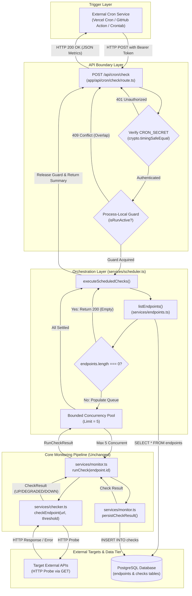

# Phase 7 Design: Scheduled API Monitoring

## 1. Purpose

The purpose of Phase 7 is to introduce automated, periodic health checking across all registered endpoints in PulseCheck without requiring manual user interaction.

Currently, PulseCheck relies exclusively on an on-demand "Check Now" trigger initiated from the dashboard. Phase 7 transitions PulseCheck into an autonomous continuous monitoring platform by establishing a decoupled, externally triggered execution pipeline.

This design specification establishes the architectural, operational, and security blueprint for the scheduling system. It enforces strict separation of concerns, reuses existing monitoring and probing primitives without modification, requires zero database schema changes, and avoids introducing heavyweight external queue infrastructure (such as Redis, BullMQ, Kafka, or dedicated worker daemons) at this stage of the system lifecycle.

---

## 2. Current Manual Monitoring Architecture

The existing monitoring pipeline executes synchronously on a per-endpoint basis driven by user action in the dashboard interface.

### Existing Flow

```
[ User UI ]
    │  (Clicks "Check Now")
    ▼
[ POST /api/endpoints/[id]/check ]
    │  (Validates endpoint ID via parseEndpointId())
    ▼
[ services/monitor.ts : runCheck(id) ]
    │  (Queries endpoints table for URL and latencyThresholdMs)
    ▼
[ services/checker.ts : checkEndpoint(url, latencyThresholdMs) ]
    │  (Dispatches HTTP probe with AbortController timeout & performance.now())
    ▼
[ Target External API ]
    │  (Returns HTTP response or throws network/timeout/DNS error)
    ▼
[ services/checker.ts ]
    │  (Classifies result: UP / DEGRADED / DOWN with error metadata)
    ▼
[ services/monitor.ts : persistCheckResult() ]
    │  (Inserts exactly one row into PostgreSQL `checks` table)
    ▼
[ HTTP Response ]
    │  (Returns RunCheckResult JSON to client)
```

### Characteristics of Current Architecture

1. **`checker.ts` (Pure HTTP Probe Engine)**:
   - Dispatches a single `GET` request to target URL.
   - Enforces configurable timeout (default: 5,000ms) via `AbortController`.
   - Uses `performance.now()` for millisecond-precision latency measurement.
   - Categorizes failures into typed errors: `invalid_url`, `timeout`, `dns`, `network`, `http`.
   - Classifies health status into `up`, `degraded`, or `down`.
   - Contains zero database imports and zero persistence responsibility.

2. **`monitor.ts` (Single Endpoint Orchestrator & Persistence)**:
   - Queries `endpoints` table for the specified `endpointId`.
   - Returns a structured `{ ok: false, error: 'ENDPOINT_NOT_FOUND' }` if missing.
   - Passes endpoint URL and latency threshold to `checker.ts`.
   - Directly persists the evaluated `CheckResult` into the `checks` table via Drizzle ORM.
   - Treats target failures (HTTP 500, DNS failure, timeout) as successful monitoring outcomes (persisted as valid check rows).
   - Allows genuine database/infrastructure exceptions to throw to the caller.

3. **`endpoints.ts` (Domain CRUD)**:
   - Provides `listEndpoints()`, `getEndpointById()`, `createEndpoint()`, and `deleteEndpoint()`.

4. **`metrics.ts` (Analytics Engine)**:
   - Pure functions (`calculateUptime`, `calculateErrorRate`, `calculateAverageLatency`, `calculateP95Latency`).
   - Query functions to fetch check history and aggregate reliability metrics over time windows.

---

## 3. Phase 7 Target Architecture

Phase 7 introduces an orchestration layer that automates execution across all registered endpoints using an externally triggered cron pattern.

### Target Flow

```
[ External Cron Trigger ]
    │
    │  HTTP POST /api/cron/check
    │  Header: Authorization: Bearer <CRON_SECRET>
    ▼
[ app/api/cron/check/route.ts ]
    │
    │  1. Authenticate CRON_SECRET (timing-safe)
    │  2. Acquire execution guard (prevent overlapping local runs)
    ▼
[ services/scheduler.ts : executeScheduledChecks() ]
    │
    │  3. Fetch all endpoints via listEndpoints() (services/endpoints.ts)
    │  4. Handle empty list gracefully (return early if 0 endpoints)
    │  5. Initialize Bounded Concurrency Pool (Concurrency Limit = 5)
    │
    ├─── Worker 1 ───► [ runCheck(endpoint1.id) ] ─┐
    ├─── Worker 2 ───► [ runCheck(endpoint2.id) ] ─┤
    ├─── Worker 3 ───► [ runCheck(endpoint3.id) ] ─┼─► (services/monitor.ts)
    ├─── Worker 4 ───► [ runCheck(endpoint4.id) ] ─┤         │
    └─── Worker 5 ───► [ runCheck(endpoint5.id) ] ─┘         ▼
                                                    [ services/checker.ts ]
                                                             │
                                                             ▼
                                                    [ Target External APIs ]
                                                             │
                                                             ▼
                                                    [ PostgreSQL: checks ]
    │
    │  6. Collect individual outcomes (successes, target failures, errors)
    │  7. Release execution guard
    ▼
[ JSON Response Summary ]
    HTTP 200 { totalEndpoints, attempted, succeeded, failed, durationMs }
```

### Key Architectural Tenets

1. **Reusability**: `scheduler.ts` delegates each probe directly to `monitor.ts:runCheck()`. Scheduled monitoring and manual monitoring follow the identical execution and persistence pipeline.
2. **Zero Health-Check Duplication**: `scheduler.ts` contains no HTTP fetch logic, no status code evaluation, and no persistence logic.
3. **Bounded Resource Footprint**: Parallel execution is strictly capped at a concurrency limit of 5.
4. **Resilient Failure Boundaries**: Target failures do not abort the scheduler run, and an error on one endpoint does not impact subsequent endpoints.

---

## 4. Responsibilities of Each Component

| Component | Layer | Primary Responsibility | Explicit Non-Responsibilities |
| :--- | :--- | :--- | :--- |
| **External Cron** | Infrastructure / Trigger | Emits periodic HTTP `POST /api/cron/check` at configured time intervals. | Contains no application logic, credentials parsing, or endpoint state knowledge. |
| **`app/api/cron/check/route.ts`** | API Boundary (Next.js) | Enforces HTTP `POST` method; extracts and validates `Authorization: Bearer <CRON_SECRET>` using timing-safe comparison; translates scheduler outcomes into HTTP response status and payloads. | Does not orchestrate batches; does not execute checks; does not access the database directly. |
| **`services/scheduler.ts`** | Orchestration Service | Loads all endpoints via `listEndpoints()`; manages bounded concurrency worker pool (concurrency = 5); executes `runCheck()` per endpoint; catches and categorizes unexpected errors; tracks run duration and aggregates execution summary; manages process-local concurrency guard. | Does not perform HTTP probes; does not insert check rows directly; does not define database schema. |
| **`services/monitor.ts`** | Monitoring Service | Coordinates a single endpoint check: fetches endpoint record, delegates probe to `checker.ts`, persists exactly one row to `checks` table via `persistCheckResult()`. | Does not manage batch concurrency; does not know about schedules or cron triggers. |
| **`services/checker.ts`** | Pure Probing Engine | Executes single HTTP probe; enforces timeout; calculates elapsed milliseconds; classifies error types (`timeout`, `dns`, `network`, `http`, `invalid_url`); determines health status (`up`, `degraded`, `down`). | Zero database interaction; zero endpoint entity awareness; zero credential awareness. |
| **`services/endpoints.ts`** | Entity Service | Provides endpoint CRUD operations and retrieval (`listEndpoints()`). | Does not trigger checks; does not calculate metrics. |
| **`services/metrics.ts`** | Analytics Service | Aggregates check records over historical windows for uptime, error rate, average latency, and P95 latency. | Does not execute checks; does not mutate check data. |
| **PostgreSQL (`endpoints`, `checks`)** | Data Tier | Persists registered endpoints and immutable check history logs. | No triggers, stored procedures, or new tables needed. |

---

## 5. Scheduler Execution Lifecycle

The scheduler execution cycle follows a deterministic 8-step lifecycle:

```
[ Step 1: Ingress & Authentication ]
  Verify HTTP method is POST.
  Validate Bearer token against process.env.CRON_SECRET in constant time.
  If invalid: Return 401 Unauthorized immediately.
         │
         ▼
[ Step 2: Concurrency & Overlap Guard Check ]
  Verify if another scheduled check is already executing on the active process.
  If active: Return 409 Conflict or 200 Skipped (see Section 13).
  Otherwise: Acquire process-local execution guard and start run stopwatch.
         │
         ▼
[ Step 3: Endpoint Retrieval ]
  Call listEndpoints() from services/endpoints.ts.
  Query: SELECT * FROM endpoints ORDER BY created_at ASC.
         │
         ▼
[ Step 4: Empty Collection Gate ]
  If endpoints.length === 0:
    Release execution guard.
    Return 200 OK with summary: { total: 0, attempted: 0, durationMs, message: "No endpoints" }.
         │
         ▼
[ Step 5: Bounded Concurrency Execution Pool ]
  Queue all endpoint IDs into a concurrency-bounded worker pool (concurrency = 5).
  Worker tasks invoke runCheck(endpoint.id) from services/monitor.ts.
  As each check completes:
    - checker.ts evaluates target health.
    - monitor.ts writes check row to database.
    - Result is collected into run accumulator.
    - Next queued endpoint begins immediately.
         │
         ▼
[ Step 6: Fault Domain Isolation & Error Handling ]
  Target API failures (HTTP 500, timeout, DNS) are captured by monitor.ts as valid check results.
  Unexpected infrastructure exceptions (e.g. transient DB disconnect on a single write)
  are caught at worker level, recorded as execution errors, and do NOT fail other tasks.
         │
         ▼
[ Step 7: Finalization & Metric Aggregation ]
  Wait for all worker tasks to settle.
  Stop run stopwatch.
  Compute execution metrics:
    - totalEndpoints
    - attempted
    - succeededChecks (probes completed and saved, regardless of target up/down status)
    - failedChecks (infrastructure/execution failures preventing check completion)
    - targetStatusCounts (up: X, degraded: Y, down: Z)
    - totalDurationMs
         │
         ▼
[ Step 8: Guard Release & Response Dispatch ]
  Release process-local execution guard in a `finally` block.
  Return HTTP 200 OK with execution summary payload.
```

---

## 6. Cron Trigger Design

### Externally Triggered Model

PulseCheck uses an **external cron trigger** model rather than an internal background process.

In modern deployment environments (such as Vercel, AWS Lambda, Docker containers, or Kubernetes pods), runtime processes are ephemeral, auto-scaled, or sleep when idle. An external cron model relies on an external scheduling service making a secure HTTP call to the application route.

Compatible external trigger providers:
- **Vercel Cron Jobs**: Configured via `vercel.json` (triggers route periodically).
- **GitHub Actions Scheduled Workflows**: Uses `on.schedule` cron expression to run `curl`.
- **Cloudflare Workers / Cron Triggers**: Dispatches HTTP POST to PulseCheck domain.
- **AWS EventBridge / CloudWatch Events**: Emits scheduled target call via API Gateway or direct HTTP.
- **Standard Linux crontab**: Simple `curl -X POST https://pulsecheck.domain.com/api/cron/check -H "Authorization: Bearer ..."` on a designated management host.

### Route Specification

- **Method**: `POST`
- **Path**: `/api/cron/check`
- **Request Headers**:
  - `Authorization: Bearer <CRON_SECRET>`
  - `Content-Type: application/json` (optional)
- **Request Body**: None required.

### Why POST Instead of GET

1. **Semantic Correctness (RFC 9110)**: HTTP `GET` requests must be safe and idempotent. A health check run creates database side effects (writing rows to the `checks` table) and dispatches outbound network traffic. HTTP `POST` explicitly communicates state mutation.
2. **Cache Avoidance**: Web browsers, CDNs (e.g., Cloudflare, Fastly), reverse proxies, and Next.js intermediate caching layers can cache `GET` requests, which would prevent the check execution from actually running.
3. **Speculative Execution Prevention**: Modern browsers and crawling bots prefetch and pre-render `GET` endpoints, which could trigger unintended monitoring runs.

### Timeout Budget

Each target check enforces an internal timeout of 5,000ms (`DEFAULT_TIMEOUT_MS`). With a bounded concurrency of 5:
- 10 endpoints: max execution duration ≈ $2 \text{ batches} \times 5\text{s} = 10\text{s}$.
- 25 endpoints: max execution duration ≈ $5 \text{ batches} \times 5\text{s} = 25\text{s}$.

Next.js Serverless Function timeout limits must be configured to accommodate expected endpoint counts (e.g., 60s max duration on Vercel Pro or Node.js server runtimes).

---

## 7. Authentication Design

### Mechanism

The route handler strictly verifies incoming requests against an environment variable: `CRON_SECRET`.

```
Incoming Request
  │
  ├─► Check process.env.CRON_SECRET is configured
  │     └─► If NOT configured: Return 500 (Server Configuration Error)
  │
  ├─► Extract 'Authorization' header
  │     └─► Format must be: 'Bearer <TOKEN>'
  │
  ├─► Timing-Safe String Comparison
  │     └─► crypto.timingSafeEqual(bufferA, bufferB)
  │
  ├─► If Token Mismatch or Header Missing:
  │     └─► Return 401 Unauthorized { error: 'Unauthorized' }
  │
  └─► If Token Matches:
        └─► Proceed to scheduler invocation
```

### Security Details

1. **Constant-Time Comparison**:
   Standard string equality (`token === secret`) is vulnerable to timing side-channel attacks, where an attacker measures response times byte-by-byte to infer secret tokens. The comparison must use `crypto.timingSafeEqual` with byte buffers of equal length.
2. **Fail-Closed Configuration**:
   If `CRON_SECRET` is unset, undefined, or empty in `process.env`, the endpoint must reject **all** requests with `500 Internal Server Error` and an operational error log ("CRON_SECRET environment variable is not configured"). It must **never** default to open or allow unauthenticated requests.
3. **Header Flexibility**:
   The primary standard header is `Authorization: Bearer <CRON_SECRET>`. The route may also inspect `x-cron-secret` as a secondary fallback to support external cron systems that do not allow arbitrary `Authorization` header configurations.
4. **Information Leakage Prevention**:
   Responses for unauthorized requests must return a generic `{ error: 'Unauthorized' }` with HTTP status `401`. Under no circumstance should the response or logs print the received token, expected token length, or partial values.

---

## 8. Concurrency Model

### Worker Pool Pattern

The scheduler uses a **bounded worker pool** pattern (or sliding window queue) with a fixed concurrency limit:

$$\text{MAX\_CONCURRENCY} = 5$$

### Conceptual Mechanism

Instead of executing all endpoints concurrently via an unbounded `Promise.all(endpoints.map(...))`, or executing them purely sequentially with high total latency, the scheduler maintains up to 5 concurrent active promises:

```
Endpoint Queue: [ E1, E2, E3, E4, E5, E6, E7, E8, E9, ... En ]

Active Slots (Limit = 5):
  Slot 1: [ E1 (Running) ] ───► Settles ──► Pulls E6 from Queue
  Slot 2: [ E2 (Running) ] ───► Settles ──► Pulls E7 from Queue
  Slot 3: [ E3 (Running) ] ───► Settles ──► Pulls E8 from Queue
  Slot 4: [ E4 (Running) ] ───► Settles ──► Pulls E9 from Queue
  Slot 5: [ E5 (Running) ] ───► Settles ──► Pulls E10 from Queue
```

### Execution Contract

1. **Queue Initialization**: The array of endpoints is loaded into an in-memory queue.
2. **Worker Dispatch**: Up to 5 worker loops run concurrently.
3. **Task Pulling**: Each worker continuously dequeues the next endpoint, awaits `runCheck(endpoint.id)`, records the structured result, and repeats until the queue is drained.
4. **Deterministic Settlement**: The orchestrator waits for all 5 worker streams to finish before compiling results.

---

## 9. Why Bounded Concurrency Is Needed

Unbounded concurrency (`Promise.all` across all endpoints simultaneously) introduces severe operational hazards:

1. **Operating System Socket Exhaustion**:
   Every HTTP probe allocates an OS-level TCP socket. If a user registers 100+ endpoints, triggering 100 simultaneous outbound TCP handshakes risks socket starvation, DNS resolver thrashing, and OS socket exhaustion errors (`EMFILE`, `ENFILE`, `ECONNRESET`).
2. **Database Connection Pool Saturation**:
   Each `runCheck()` executes a Drizzle ORM query to select the endpoint and an `insert` query to persist the check result. If 100 checks resolve at the same moment, the database connection pool (often limited to 10–20 connections on serverless PostgreSQL like Neon or Supabase) would be instantly overwhelmed, resulting in connection pool timeouts (`53300: too many connections`).
3. **Accidental Target DDoS / Self-Inflicted Rate Limiting**:
   Multiple endpoints in the registry may point to different routes on the same host (e.g., `https://api.acme.com/v1/health` and `https://api.acme.com/v1/users`). Firing dozens of simultaneous probes against the same host can trigger rate-limiting (HTTP 429), WAF IP bans, or degrade the target application.
4. **Serverless Function Memory & CPU Spikes**:
   Node.js event loop lag increases significantly under mass parallel async I/O. Bounded concurrency keeps CPU and memory allocation predictable and linear.

---

## 10. Failure Semantics

A core platform design requirement is the strict distinction between **Target Failures** and **Infrastructure Failures**.

```
                           Probe Invocation
                                  │
                  ┌───────────────┴───────────────┐
                  ▼                               ▼
          Target Failures              Infrastructure Failures
    (HTTP 500, 404, DNS, Timeout)   (Postgres Down, Network Partition)
                  │                               │
                  ▼                               ▼
        Expected Result                 System / Pipeline Error
  Persisted to `checks` table             Cannot persist check
      Scheduler: SUCCESS                     Scheduler: ERROR
      HTTP Status: 200                       Surfaced in Summary
```

### Classification Matrix

| Event | Category | Classification | Handled By | Persisted in DB? | Scheduler Impact |
| :--- | :--- | :--- | :--- | :--- | :--- |
| **HTTP 200 (Latency $\le$ Threshold)** | Target Success | Status: `up` | `checker.ts` | Yes (`checks` row) | Success |
| **HTTP 200 (Latency $>$ Threshold)** | Target Degradation | Status: `degraded` | `checker.ts` | Yes (`checks` row) | Success |
| **HTTP 4xx / 5xx** | Target Failure | Status: `down`, error: `http` | `checker.ts` | Yes (`checks` row) | Success |
| **Probe Timeout (5000ms)** | Target Failure | Status: `down`, error: `timeout` | `checker.ts` | Yes (`checks` row) | Success |
| **Target DNS Failure (`ENOTFOUND`)** | Target Failure | Status: `down`, error: `dns` | `checker.ts` | Yes (`checks` row) | Success |
| **Invalid Target URL** | Target Failure | Status: `down`, error: `invalid_url`| `checker.ts` | Yes (`checks` row) | Success |
| **Database Unreachable (`listEndpoints`)** | Infra Failure | Fatal DB Error | `scheduler.ts` | No (cannot connect) | Scheduler Fails (HTTP 500) |
| **Database Unreachable (`persistCheck`)** | Infra Failure | Endpoint Check Error | Worker pool | No (DB write failed) | Endpoint marked as Error |
| **Invalid CRON_SECRET** | Auth Failure | Unauthorized | Route Handler | No | Request Rejected (HTTP 401) |

### Key Rule
**Target API failures are expected monitoring observations, NOT scheduler errors.** When target `https://api.example.com` returns HTTP 503 Service Unavailable, the scheduler has successfully executed its job. The check record with `status = 'down'` is written to PostgreSQL, and the overall scheduler run reports success.

---

## 11. Partial Failure Behavior

In a batch monitoring run with $N$ endpoints, failures must be isolated to their respective fault domains.

### Isolation Rules

1. **Independent Execution**:
   If Endpoint 1 experiences a fatal network timeout or DNS resolution crash, it has zero impact on Endpoint 2, 3, or 4.
2. **Worker-Level Error Boundaries**:
   Every call to `runCheck(endpoint.id)` is wrapped in an isolated `try/catch` block within the worker pool:
   - If `runCheck()` resolves normally (whether target is UP, DEGRADED, or DOWN), the result is aggregated.
   - If `runCheck()` rejects with an unexpected error (e.g. database disconnect during write), the error is caught, logged with the associated `endpointId`, and stored in the execution summary as `{ endpointId, status: 'error', error: error.message }`.
   - The worker moves immediately to the next queued endpoint.
3. **Cron Batch Outcome**:
   If at least the endpoint discovery query succeeded, the batch run finishes and returns HTTP 200 with a detailed report showing which endpoints were monitored and which encountered infrastructure errors.
4. **Catastrophic Failure Threshold**:
   Only if the initial endpoint discovery query (`listEndpoints()`) throws does the scheduler abort before running workers, returning HTTP 500 Internal Server Error.

---

## 12. Empty Endpoint Behavior

When a scheduled run executes on a system with zero registered endpoints (e.g. fresh installation or all endpoints deleted):

1. **Valid Operational State**: An empty endpoint list is a completely normal, valid state. It must **not** throw an exception, emit error logs, or return an HTTP error status code.
2. **Execution Flow**:
   - `listEndpoints()` returns an empty array `[]`.
   - The scheduler detects `endpoints.length === 0`.
   - The worker pool is not dispatched.
   - The process-local guard is released.
3. **Response Payload**:
   Returns HTTP 200 OK immediately with an execution time under 10ms:
   ```json
   {
     "success": true,
     "totalEndpoints": 0,
     "attempted": 0,
     "succeeded": 0,
     "failed": 0,
     "durationMs": 4,
     "message": "No endpoints configured for monitoring"
   }
   ```

---

## 13. Overlapping Execution Strategy

### The Overlap Problem

If the external cron triggers every 60 seconds, but a large endpoint registry or slow targets cause the execution run to take 65 seconds, two runs could execute concurrently.

### Process-Local Guard (Phase 7)

For Phase 7, a **process-local execution guard** is introduced:
- A module-scoped state variable tracks whether a scheduled run is actively executing within the Node.js process:
  - `isRunActive: boolean`
  - `activeRunStartedAt: Date | null`
  - `activeRunId: string | null`
- When a new request arrives:
  - If `isRunActive === true`: Check elapsed time. If elapsed time is less than a safety threshold (e.g., 60 seconds), reject the overlapping invocation by returning HTTP 409 Conflict (or HTTP 200 with `{ skipped: true, reason: 'Previous check run still active' }`).
  - If elapsed time exceeds the safety threshold, assume the previous run encountered an unhandled zombie state, force-release the lock, log a warning, and proceed.
  - Otherwise, set `isRunActive = true` and record the start timestamp.
- Upon completion (or failure), release the lock in a mandatory `finally` block:
  ```typescript
  try {
    // execute batch
  } finally {
    isRunActive = false;
    activeRunStartedAt = null;
  }
  ```

### Explicit Disclaimer: NOT a Distributed Lock

> [!WARNING]
> A process-local in-memory flag is **NOT a distributed lock**.
> In multi-instance deployments (such as multiple Vercel serverless function instances, multiple Docker containers behind a load balancer, or multiple Kubernetes pods), each instance runs in an isolated Node.js memory space. A request hitting Instance A cannot see the in-memory flag of Instance B.
> For single-instance or serverless environments with a single external cron caller, the process-local guard protects against concurrent local invocations and stale promises. Multi-instance locking requirements are detailed in Section 17 and Section 19.

---

## 14. Global Interval Decision

Phase 7 adopts a **single global cron interval** (e.g. 1 minute or 5 minutes) that monitors all registered endpoints simultaneously during each run.

### Why Global Interval in Phase 7

1. **Simplicity & Predictability**: A single global schedule drastically reduces operational surface area. Every endpoint is checked at the exact same cadence.
2. **Zero Schema Alterations**: Supporting individual per-endpoint intervals (e.g., Endpoint A every 30s, Endpoint B every 10m) would require:
   - Altering the `endpoints` table to add `check_interval_seconds` and `next_check_at`.
   - Complex due-time calculation queries (`WHERE next_check_at <= NOW()`).
   - Transactional locking (`SELECT ... FOR UPDATE SKIP LOCKED`) to prevent duplicate scheduling.
   - Handling clock drift across application instances.
   All of these require schema modifications, which are strictly prohibited in Phase 7.
3. **Sufficient for Target Scale**: For Phase 7 workloads (tens of endpoints), checking all endpoints on each trigger pulse aligns directly with standard operational monitoring requirements.

---

## 15. Database Impact

### Write Volume Analysis

Every completed endpoint check inserts exactly 1 row into the `checks` table.

Let $N$ be the number of active endpoints, and $I$ be the cron interval in minutes:

$$\text{Inserts per Day} = N \times \left(\frac{1440}{I}\right)$$

| Endpoints ($N$) | Interval ($I$) | Writes / Hour | Writes / Day | Writes / Month (30d) | Storage Est. / Month (~150B/row) |
| :--- | :--- | :--- | :--- | :--- | :--- |
| **5** | 1 min | 300 | 7,200 | 216,000 | ~32 MB |
| **10** | 1 min | 600 | 14,400 | 432,000 | ~65 MB |
| **25** | 1 min | 1,500 | 36,000 | 1,080,000 | ~162 MB |
| **25** | 5 min | 300 | 7,200 | 216,000 | ~32 MB |
| **100** | 5 min | 1,200 | 28,800 | 864,000 | ~130 MB |

### Index Utilization & Performance

- The existing schema specifies an index:
  ```typescript
  index('checks_endpoint_id_checked_at_idx').on(table.endpointId, table.checkedAt.desc())
  ```
- **Insert Overhead**: Check insertions are append-only. Because `checked_at` defaults to `now()`, inserts append sequentially to the B-tree index, resulting in minimal page splits and virtually no write contention.
- **Connection Count**: Because concurrency is strictly bounded to 5, at most 5 database write operations are in flight at any given millisecond. This easily fits within default PostgreSQL connection pools (e.g. Neon connection pooling limit of 20–100 connections).

---

## 16. Security Considerations

1. **Authentication Token Protection**:
   - `CRON_SECRET` must be a high-entropy cryptographically secure string (e.g. 256-bit hex or base64 token).
   - Must be stored exclusively in server-side environment variables (`.env.local` / platform secret managers).
   - Must never be prefixed with `NEXT_PUBLIC_`, ensuring it is never bundled into client JavaScript.
2. **Timing Attack Mitigation**:
   - Route authentication must evaluate incoming tokens via `crypto.timingSafeEqual`.
3. **Credential & Sensitive Data Scrubbing**:
   - The scheduler and route handlers must never log the `Authorization` header, raw token values, or endpoint query parameters that might carry sensitive keys.
   - Response payloads must only contain aggregate counts and status codes, never secrets.
4. **Denial of Service Prevention**:
   - If the cron route were unauthenticated, external actors could flood `/api/cron/check`, causing mass outbound HTTP requests and filling the database with check rows. The mandatory auth gate stops unauthorized requests at the perimeter.
5. **SSRF (Server-Side Request Forgery) Awareness**:
   - The health checker dispatches HTTP requests from the PulseCheck server to URLs registered in the `endpoints` table.
   - Endpoint registration validation in `endpoints.ts` currently validates URL syntax and protocols (`http:`, `https:`).
   - In production or multi-tenant deployments, additional SSRF guards should be considered (blocking probes against cloud metadata endpoints like `169.254.169.254` and private subnets like `10.0.0.0/8`, `192.168.0.0/16`, `127.0.0.1`).

---

## 17. Deployment Considerations

### Serverless Environments (e.g. Vercel)

- **Execution Timeout**: Default serverless function timeouts on free tiers can be as low as 10s–15s (60s on paid tiers). With bounded concurrency of 5 and a 5,000ms probe timeout, the maximum endpoint capacity per 60s execution window is approximately 50 endpoints.
- **Stateless Execution**: Serverless instances spin up and tear down on demand. The process-local guard is effective only within an active instance container.
- **Vercel Cron Setup**: Requires a `vercel.json` configuration defining the schedule and route path. Vercel automatically passes `Authorization: Bearer ${CRON_SECRET}` if configured in project settings.

### Containerized / Node.js Server Environments (e.g. Docker, Railway, Render)

- **Process Persistence**: The application runs continuously as a Node.js process (`next start`).
- **Timeout Flexibility**: No strict 10s serverless gateway timeout; executions can comfortably span 30–60s if needed.
- **External Triggering**: An external cron provider or local Linux host cron triggers the service via `curl` over HTTPS.

### Required Deployment Configuration

- `DATABASE_URL`: Valid PostgreSQL connection string with SSL configuration.
- `CRON_SECRET`: Required secret token configured in production environment variables.

---

## 18. What Is Intentionally NOT Being Built

To prevent scope creep, maintain architecture integrity, and respect the explicit constraints of Phase 7, the following items are **intentionally excluded**:

1. **No Database Schema Changes**:
   - No new tables (e.g., no `schedules`, no `cron_jobs`, no `locks` table).
   - No new columns on `endpoints` (e.g., no `interval`, `enabled`, `last_checked_at`).
   - No Drizzle migrations.
2. **No External Queue Infrastructure**:
   - No Redis.
   - No BullMQ, Bee-Queue, or Celery.
   - No Apache Kafka or RabbitMQ.
   - No AWS SQS or GCP Pub/Sub.
3. **No Internal `setInterval()` Daemon**:
   - No long-running background timer loops running inside the web application process.
4. **No Per-Endpoint Custom Intervals**:
   - All endpoints are checked on the same trigger invocation.
5. **No Outbound Alerting Channels**:
   - No Slack, Discord, PagerDuty, SMS, or Email integrations. (Scheduled for later alerting phase).
6. **No Distributed Locking Service**:
   - No Redis Redlock or ZooKeeper coordination.
7. **No UI Changes**:
   - The dashboard interface and components are not altered in this backend phase.

---

## 19. Future Scalability Considerations

When PulseCheck scales beyond the capacity of a single bounded cron invocation (e.g., hundreds or thousands of endpoints, or multi-region probing), the following architectural evolution path is recommended:

```
[ Future Architecture Roadmap ]

Phase 7 (Current Design):
  External Cron ──► POST /api/cron/check ──► Concurrency Pool (5) ──► PostgreSQL

Future Scale (Stage 2: Database-Backed Queue & Advisory Locks):
  External Cron ──► POST /api/cron/check
                          │
                          ▼
            PostgreSQL Advisory Lock (pg_try_advisory_lock)
                          │
                          ▼
            Select due endpoints (FOR UPDATE SKIP LOCKED)
                          │
                          ▼
            Worker Pool with adaptive concurrency (10-20)

Future Scale (Stage 3: Distributed Asynchronous Worker Architecture):
  External Cron / Scheduler
        │
        ▼
  Message Broker (BullMQ / Redis or SQS)
        │
   ┌────┴────────────────────────┬────────────────────────┐
   ▼                             ▼                        ▼
Worker Pod 1 (US-East)     Worker Pod 2 (EU-West)   Worker Pod 3 (AP-South)
   │                             │                        │
   └─────────────────────────────┼────────────────────────┘
                                 ▼
                     PostgreSQL TimescaleDB Cluster
```

1. **PostgreSQL Advisory Locks for Multi-Instance Deployments**:
   Before introducing Redis, multi-instance Next.js deployments can achieve zero-dependency distributed locking by leveraging PostgreSQL session or transaction advisory locks (`SELECT pg_try_advisory_lock(42)`).
2. **Due-Time Scheduling & Cursor Pagination**:
   Introducing `interval_seconds` and `next_check_at` columns on `endpoints`, querying only due records (`WHERE next_check_at <= NOW() LIMIT 50`) using `FOR UPDATE SKIP LOCKED`.
3. **Data Retention & Timeseries Partitioning**:
   As `checks` surpasses millions of rows, implement a daily cleanup retention cron (`DELETE FROM checks WHERE checked_at < NOW() - INTERVAL '30 days'`) or partition the `checks` table by month.
4. **Distributed Queue Workers**:
   Transitioning `runCheck` execution into background jobs processed by distributed workers across multiple geographical regions.

---

## 20. Architecture Diagram

### Component & Data Flow Diagram



### Sequence Flow Diagram

```
External Cron      route.ts       scheduler.ts      monitor.ts      checker.ts      Target API      Postgres DB
     │                │                 │                │               │               │               │
     │──POST /check──►│                 │                │               │               │               │
     │  (Bearer token)│                 │                │               │               │               │
     │                │─Verify Secret   │                │               │               │               │
     │                │─Check Lock      │                │               │               │               │
     │                │                 │                │               │               │               │
     │                │──execute()─────►│                │               │               │               │
     │                │                 │──listEndpoints()──────────────────────────────────────────────►│
     │                │                 │◄─Endpoint List─────────────────────────────────────────────────│
     │                │                 │                                                                │
     │                │                 │──[Loop: Pool Limit 5]                                          │
     │                │                 │    │                                                           │
     │                │                 │    ├──runCheck(id)────►│                                       │
     │                │                 │    │                   ├──checkEndpoint()─►│                   │
     │                │                 │    │                   │                   ├──HTTP GET────────►│
     │                │                 │    │                   │                   │◄──Response/Err────│
     │                │                 │    │                   │◄──CheckResult─────│                   │
     │                │                 │    │                   │                                       │
     │                │                 │    │                   ├──persistCheckResult()────────────────►│
     │                │                 │    │                   │◄──Saved Check─────────────────────────│
     │                │                 │    │◄──RunCheckResult──│                                       │
     │                │                 │                                                                │
     │                │                 │──[All Settled]                                                 │
     │                │                 │─Aggregate metrics                                              │
     │                │                 │─Release Lock                                                   │
     │                │◄─Summary JSON───│                                                                │
     │◄──HTTP 200─────│                                                                                 │
     │   (Summary)    │                                                                                 │
```

---

## 21. Phase 7 Acceptance Criteria

Before implementation is considered complete, the solution must satisfy all of the following verifiable engineering acceptance criteria:

### 1. Ingress & Authentication
- [ ] `POST /api/cron/check` rejects requests with missing `Authorization` header with `401 Unauthorized`.
- [ ] `POST /api/cron/check` rejects requests with invalid `CRON_SECRET` tokens with `401 Unauthorized`.
- [ ] Token comparison is performed in constant time using `crypto.timingSafeEqual`.
- [ ] Non-POST methods (`GET`, `PUT`, `DELETE`, `PATCH`) return `405 Method Not Allowed`.
- [ ] If `CRON_SECRET` is unset in server environment, the endpoint fails closed and returns `500 Internal Server Error`.
- [ ] Under no circumstance is `CRON_SECRET` exposed in logs or JSON response bodies.

### 2. Orchestration & Concurrency
- [ ] `services/scheduler.ts` fetches endpoints exclusively via `services/endpoints.ts:listEndpoints()`.
- [ ] Concurrency across checks is strictly bounded to a maximum of 5 concurrent operations at any given moment.
- [ ] Check orchestration invokes existing `services/monitor.ts:runCheck(endpoint.id)` without reimplementing HTTP probing or database insertion logic.
- [ ] `services/checker.ts` remains completely untouched and unaware of scheduler or database.

### 3. Failure & Error Isolation
- [ ] Target API failures (e.g. HTTP 500, HTTP 404, DNS `ENOTFOUND`, request timeout) are saved as `checks` rows with `status = 'down'` and do **not** fail the scheduler run.
- [ ] An unhandled exception or network failure on one endpoint does not halt or abort checks for the remaining endpoints.
- [ ] If an endpoint fails at the infrastructure level (e.g. database insertion error), the error is isolated, recorded in the summary error count, and remaining endpoints continue processing.
- [ ] If the initial database query for endpoint retrieval (`listEndpoints()`) fails, the scheduler surfaces a fatal infrastructure error and returns `500 Internal Server Error`.

### 4. Edge Cases & Zero State
- [ ] When the `endpoints` table is empty (`0` registered endpoints), `POST /api/cron/check` succeeds with `HTTP 200 OK` and returns `{ totalEndpoints: 0, attempted: 0, succeeded: 0, failed: 0 }`.
- [ ] Process-local execution guard prevents concurrent overlapping runs on the same instance, returning `409 Conflict` (or skipped summary) if an execution is already active.

### 5. Schema & Architectural Integrity
- [ ] Zero database schema changes or migrations are introduced.
- [ ] No external queue brokers (Redis, BullMQ, Kafka, RabbitMQ) are added to the project.
- [ ] Both manual checks (`POST /api/endpoints/[id]/check`) and scheduled checks (`POST /api/cron/check`) produce identical `checks` records through the shared `monitor.ts` pipeline.
- [ ] Unit and integration test coverage validates authentication, empty states, bounded concurrency, target failure recording, and partial failure isolation.
